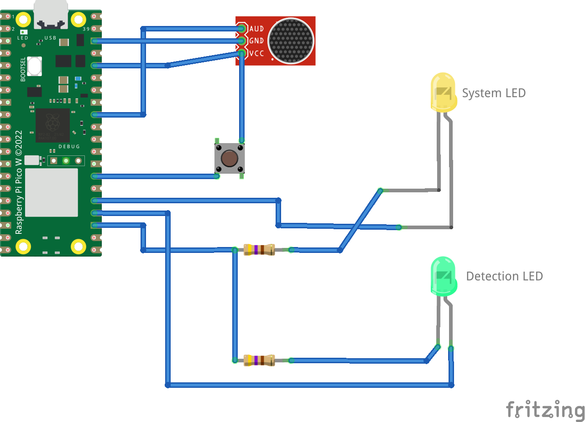

# Speech Recognition Using CircuitPython
[](https://www.youtube.com/watch?v=COsEE_Mif4k)


This repository contains code and instructions to implement single word speech recognition using neural networks on any board running CircuitPython.
The code and instructions were tested with Raspberry Pi Pico board, but should work with almost any board that supports CircuitPython.
This work is mainly inspired from [a tutorial on tensorflow's website](https://www.tensorflow.org/tutorials/audio/simple_audio). 

Despite being highly experimental, the code is fun to play with 🙂.

## Hardware Requirements
Assuming we are using a Raspiberry Pi Pico:

- Raspberry Pi Pico running CircuitPython 9
- A Electret Mic Breakout Board (like [this one](https://www.sparkfun.com/products/12758)). Note: You will need to modify the code if you use a PDM Microphone.
- A pushbutton switch
- LEDs (yellow and green)
- Current limiting resistors.
- Wires for connecting components

## Connections

- The output of microphone is connected to `A1` of  the Pi Pico. Input to VCC of microphone board is 3.3(OUT) of the Pi Pico.
- The pushbutton is connected to `GP21` of the Pi Pico.
- Yellow LED (system indicator), connected to 'GP19' of the Pi Pico via current limiting resistor.
- Green LED (detection indicator), connected to 'GP18' of the Pi Pico via current limiting resistor.



## Detecting speech.

Copy the following files to the Pi Pico board:

- `code.py`
- `stop_model_min.py`
- `on_model_min.py`
- `no_model_min.py`
- `yes_model_min.py`

Choose your model by uncommenting the appropriate line in code.py (only one model works at a time due to memory constraints):

```python
from yes_model_min import predict
#from no_model_min import predict
```

After copying the files, your board will reboot. Wait for the yellow LED to flash (this takes about 30 seconds). This means the system is ready. Now, press the pushbutton and speak the word you want the Pi Pico to recognize (like "on"). The yellow LED will light up for a second – make sure you speak while it's on. If the word is detected, the green LED will blink a couple of times. If not, give it another try!


## How it works

Please read this article for more details on the technique that was used to train the model more information on debugging.

## Adjusting detection threshold

Try to play around with detection threshold in `code.py` to increase accuracy of detection. Modify this line:

```python
#change 0.70 to whatever works for your model.
if prediction[0] > 0.70: 
             detected()
```

## Identifying other words

Want to teach your Pi Pico new words? Check out this [Kaggle notebook](https://www.kaggle.com/code/finalepoch/speech-recognition-using-circuitpython) for instructions on training a model using the '[Speech Commands Dataset](http://download.tensorflow.org/data/speech_commands_v0.01.tar.gz)'.


I'd be glad to create a response that incorporates the best aspects of Response A and Response B, addresses their shortcomings based on the ratings, and adheres to the task instructions:

## Known Issues

**1. Intermittent USB Error on Windows 10**

- **Description:** The Pi Pico may not be recognized correctly as a USB drive when connected to a Windows 10 PC while running this code. This can manifest as a USB error.
- **Workaround:**
    1. **Restart the computer:** This often can be resolved  by restarting the PC.
    2. **Reset flash memory (if restart fails):** If restarting doesn't work, follow the guide on [Adafruit](https://learn.adafruit.com/getting-started-with-raspberry-pi-pico-circuitpython/circuitpython#flash-resetting-uf2-3083182) to reset the Pico's flash memory and reinstall CircuitPython, then upload the code.

**2. Slow Startup**

- **Description:** Takes around 20-30 seconds to boot after uploading the code.
- **Causes:**
    - Large model files
    - Hardware limitations of the Pi Pico
- **Mitigation Strategies:**
    - Use [mpy-cross](https://pypi.org/project/mpy-cross/) to reduce size of Python code.

**3. Limited Accuracy and Unrelated Word Detection**

- **Description:** The code might sometimes produce inaccurate results, triggering detections for totally un-related words.
- **Potential Causes:**
    - Imperfections in the underlying machine learning model or training data
    - Environmental factors affecting audio capture (noise, background sounds)
- **Potential Solutions:**
    - Refine the machine learning model:
        - Retrain the model with a larger and more diverse dataset to improve its generalization ability.
        - Consider using data augmentation techniques to artificially expand the training dataset.
        - Experiment with different model architectures and hyper-parameters to find one that performs well on your specific task.
    - Enhance audio capture quality:
        - Implement noise reduction techniques in your code to filter out unwanted background sounds.

