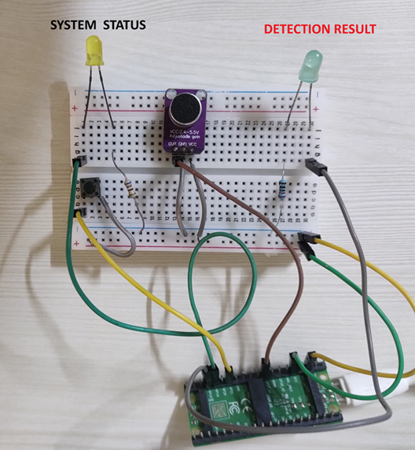
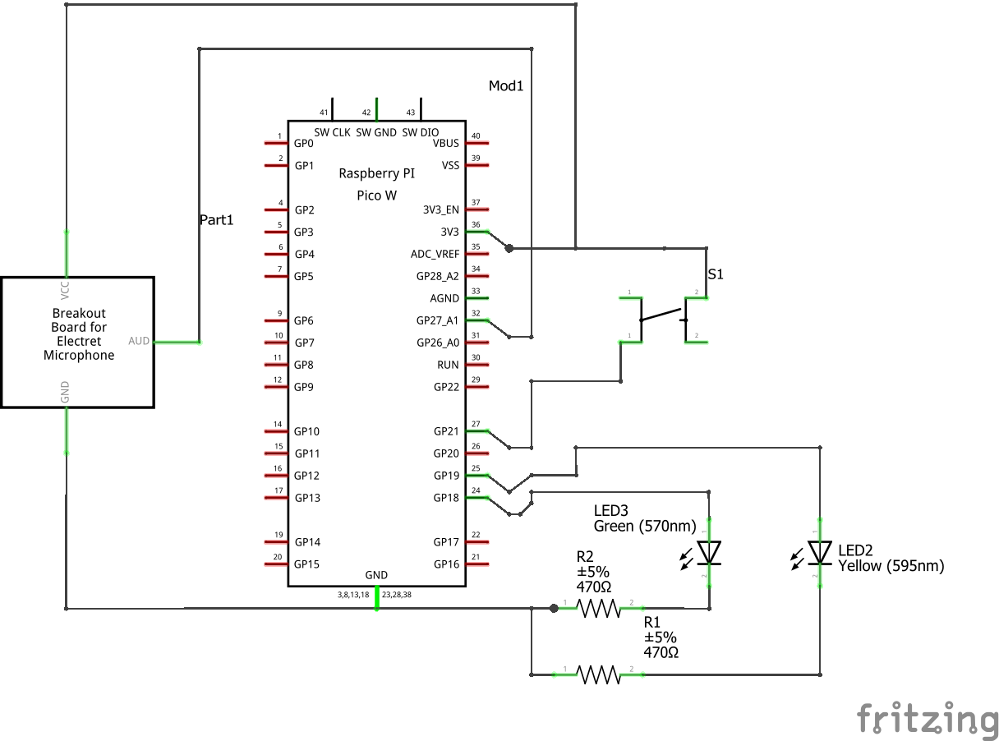

# Speech Recognition Using CircuitPython


This repository contains code and instructions to implement single word speech recognition using neural networks on any board running CircuitPython.
The code and instructions were tested with Raspberry Pi Pico board, but should work with almost any board that supports CircuitPython.
This work is mainly inspired from [a tutorial on tensorflow's website](https://www.tensorflow.org/tutorials/audio/simple_audio). 

Despite being highly experimental, the code is fun to play with 🙂.

## Hardware Requirements
Assuming we are using a Raspiberry Pi Pico:

- Raspberry Pi Pico running CircuitPython 9
- A Electret Mic Breakout Board (like [this one](https://www.sparkfun.com/products/12758)). Note: You will need to modify the code if you use a PDM Microphone.
- A pushbutton switch
- LEDs (yellow and green)
- Current limiting resistors.
- Wires for connecting components

## Connections

- The output of microphone is connected to `A1` of  the Pi Pico. Input to VCC of microphone board is 3.3(OUT) of the Pi Pico.
- The pushbutton is connected to `GP21` of the Pi Pico.
- Yellow LED (system indicator), connected to 'GP19' of the Pi Pico via current limiting resistor.
- Green LED (detection indicator), connected to 'GP18' of the Pi Pico via current limiting resistor.




## Detecting speech.

Copy the following files to the Pi Pico board:

- `code.py`
- `stop_model_min.py`
- `on_model_min.py`
- `no_model_min.py`
- `yes_model_min.py`

Choose your model by uncommenting the appropriate line in code.py (only one model works at a time due to memory constraints):

```python
from yes_model_min import predict
#from no_model_min import predict
```

After copying the files, your board will reboot. Wait for the yellow LED to flash (this takes about 30 seconds). This means the system is ready. Now, press the pushbutton and speak the word you want the Pi Pico to recognize (like "on"). The yellow LED will light up for a second – make sure you speak while it's on. If the word is detected, the green LED will blink a couple of times. If not, give it another try!


## How it works

Please read this article for more details on the technique that was used to train the model more information on debugging.

## Adjusting detection threshold

Try to play around with detection threshold in `code.py` to increase accuracy of detection. Modify this line:

```python
#change 0.70 to whatever works for your model.
if prediction[0] > 0.70: 
             detected()
```

## Identifying other words

Want to teach your Pi Pico new words? Check out this [Kaggle notebook](https://www.kaggle.com/code/finalepoch/speech-recognition-using-circuitpython) for instructions on training a model using the '[Speech Commands Dataset](http://download.tensorflow.org/data/speech_commands_v0.01.tar.gz)'.
